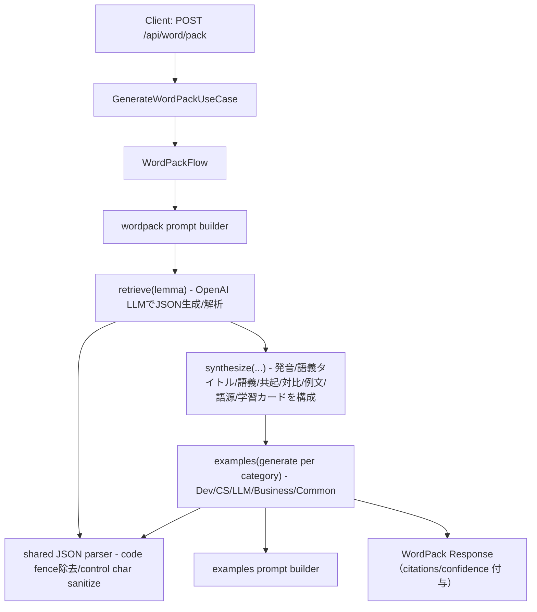
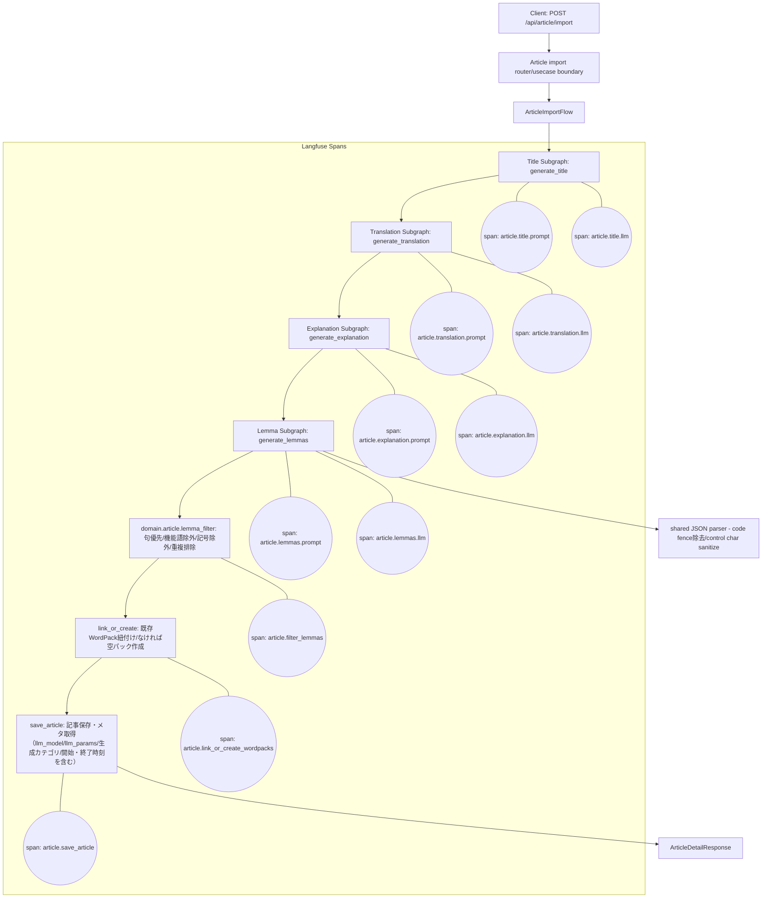

# 付録: AI処理フロー

## WordPackFlow（語彙パック生成）

`WordPackFlow` は `backend.infrastructure.llm.wordpack_generator` から呼び出す outer adapter として扱う。
prompt 構築は `backend.infrastructure.llm.prompts`、JSON 解析は `backend.infrastructure.llm.json_response_parser`、
生成後の構成は flow 内の orchestration に分かれている。例文生成はカテゴリごとの独立した LLM 呼び出しで、
停止条件を明確にするため逐次実行する。旧 `backend.application.wordpack.generate_wordpack` は互換 import path であり、新規内部コードは adapter 側を使う。

## ArticleImportFlow（文章インポート）

