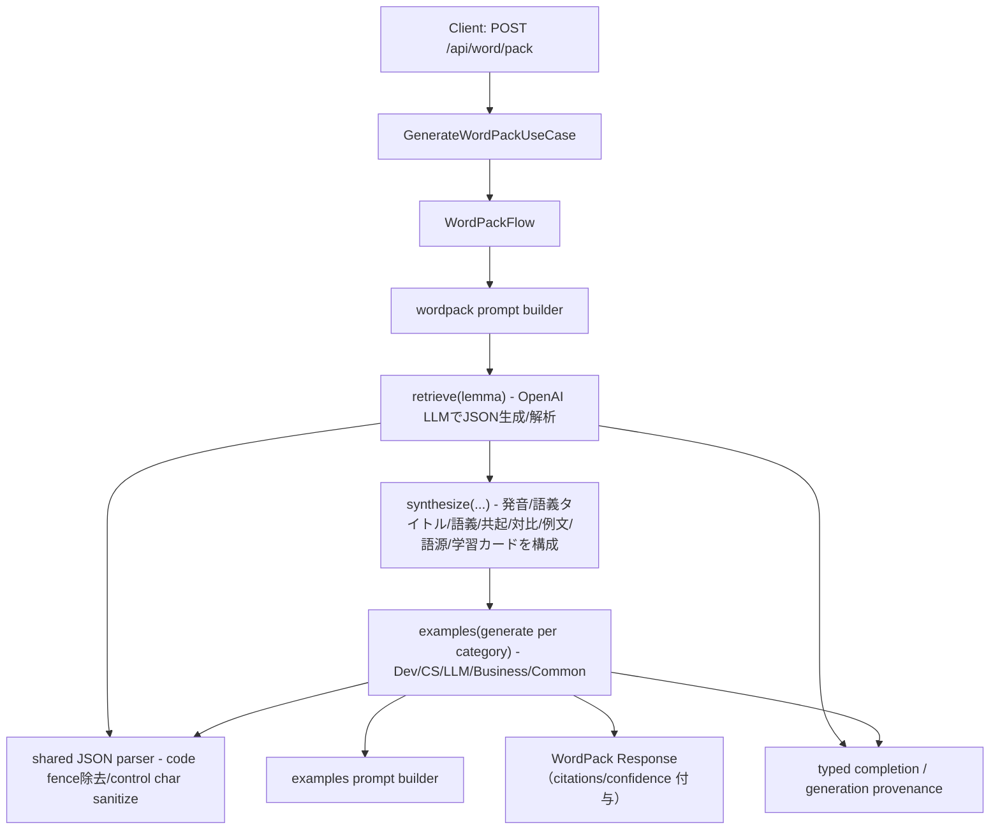
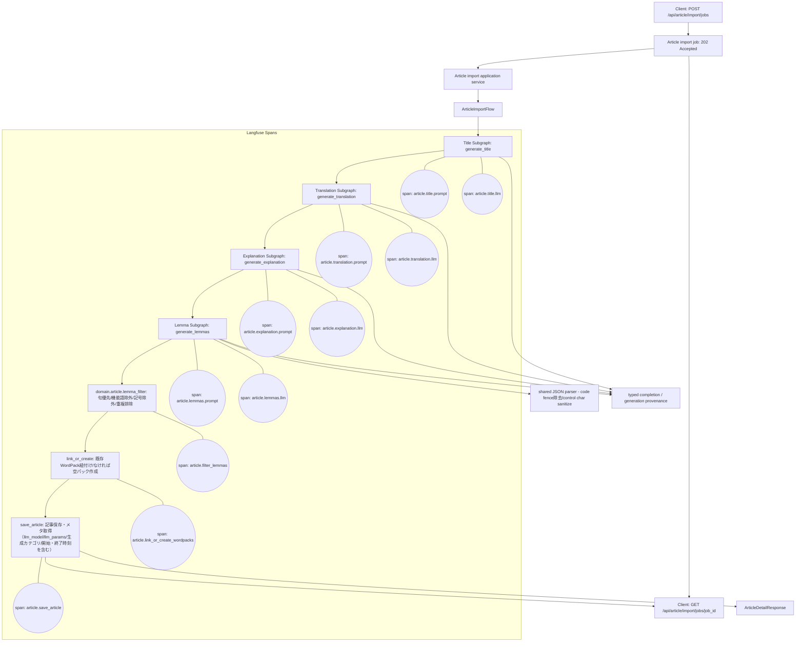

# 付録: AI処理フロー

## WordPackFlow（語彙パック生成）

```mermaid
graph TD
    A[Client: POST /api/word/pack] --> U[GenerateWordPackUseCase];
    U --> B[WordPackFlow];
    B --> P["wordpack prompt builder"];
    P --> C["retrieve(lemma) - OpenAI LLMでJSON生成/解析"];
    C --> JP["shared JSON parser - code fence除去/control char sanitize"];
    C --> D["synthesize(...) - 発音/語義タイトル/語義/共起/対比/例文/語源/学習カードを構成"];
    D --> E["examples(generate per category) - Dev/CS/LLM/Business/Common"];
    E --> EP["examples prompt builder"];
    E --> JP;
    E --> F["WordPack Response（citations/confidence 付与）"];
    C --> PV["typed completion / generation provenance"];
    E --> PV;
```

`WordPackFlow` は `backend.infrastructure.llm.wordpack_generator` から呼び出す outer adapter として扱う。
prompt 構築は `backend.infrastructure.llm.prompts`、JSON 解析は `backend.infrastructure.llm.json_response_parser`、
生成後の構成は flow 内の orchestration に分かれている。例文生成はカテゴリごとの独立した LLM 呼び出しで、
停止条件を明確にするため逐次実行する。旧 `backend.application.wordpack.generate_wordpack` は互換 import path であり、新規内部コードは adapter 側を使う。
WordPack 本体1回と5カテゴリ例文の計6回という既存 call 数を維持し、各結果の provenance は既存保存 write に同梱する。

## ArticleImportFlow（文章インポート）

```mermaid
graph TD
    A[Client: POST /api/article/import/jobs] --> J[Article import job: 202 Accepted];
    J --> P[Client: GET /api/article/import/jobs/job_id];
    J --> U[Article import application service];
    U --> B[ArticleImportFlow];
    B --> T[Title Subgraph: generate_title];
    T --> TR[Translation Subgraph: generate_translation];
    TR --> EX[Explanation Subgraph: generate_explanation];
    EX --> LM[Lemma Subgraph: generate_lemmas];
    LM --> JP["shared JSON parser - code fence除去/control char sanitize"];
    LM --> FL["domain.article.lemma_filter: 句優先/機能語除外/記号除外/重複排除"];
    FL --> LC[link_or_create: 既存WordPack紐付け/なければ空パック作成];
    LC --> SA[save_article: 記事保存・メタ取得（llm_model/llm_params/生成カテゴリ/開始・終了時刻を含む）];
    SA --> P;
    SA --> R[ArticleDetailResponse];
    T --> PV["typed completion / generation provenance"];
    TR --> PV;
    EX --> PV;
    LM --> PV;

    subgraph Langfuse Spans
        T --- T1((span: article.title.prompt))
        T --- T2((span: article.title.llm))
        TR --- TR1((span: article.translation.prompt))
        TR --- TR2((span: article.translation.llm))
        EX --- EX1((span: article.explanation.prompt))
        EX --- EX2((span: article.explanation.llm))
        LM --- LM1((span: article.lemmas.prompt))
        LM --- LM2((span: article.lemmas.llm))
        FL --- FL1((span: article.filter_lemmas))
        LC --- LC1((span: article.link_or_create_wordpacks))
        SA --- SA1((span: article.save_article))
    end
```

Article はタイトル・翻訳・解説・lemma 抽出の計4回という既存 call 数を維持する。Quiz は正常系1回で、parse 修復が必要な場合だけ既存の修復 call を使う。来歴の共通契約は [LLMOps](llmops/provenance.md) を参照する。
