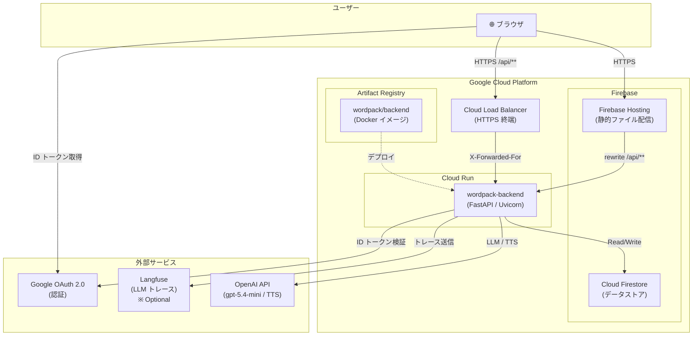
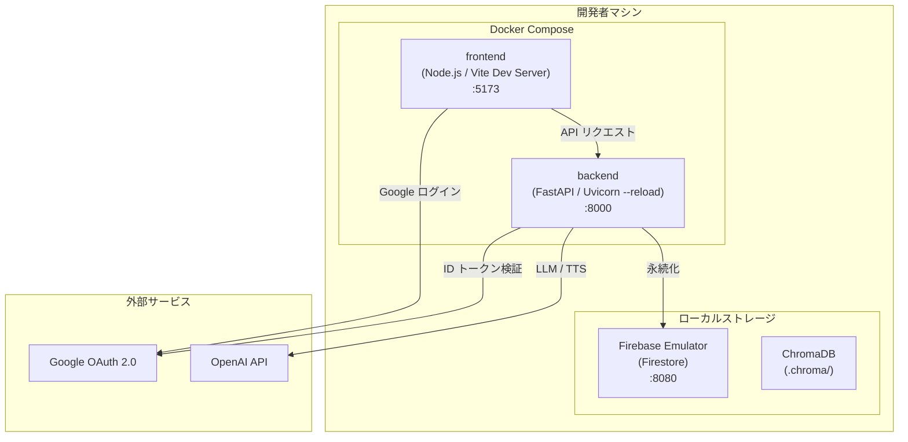
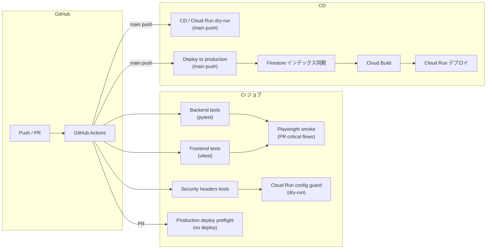
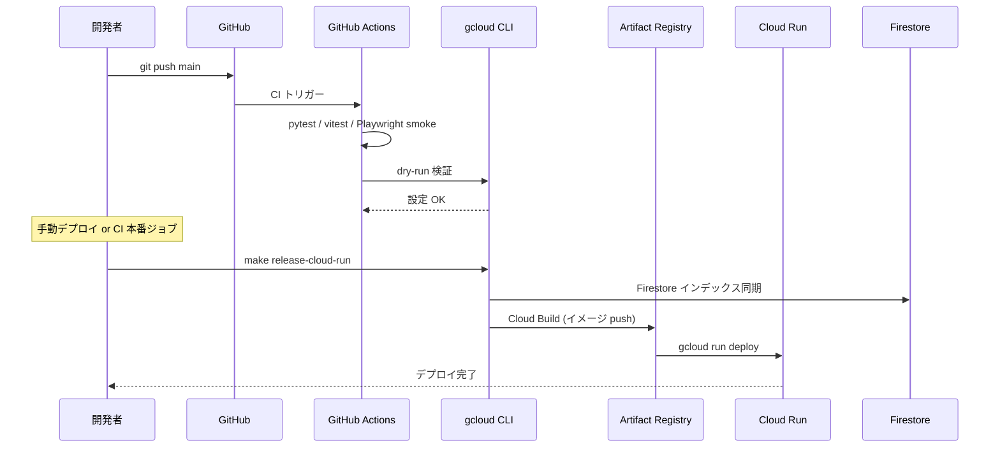
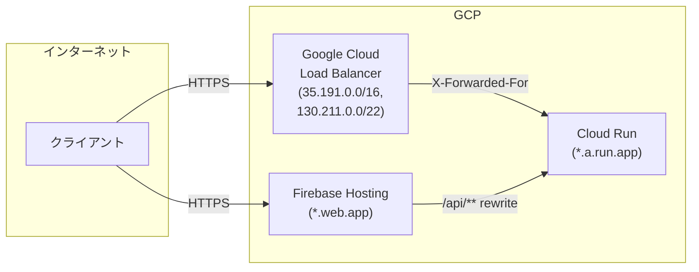
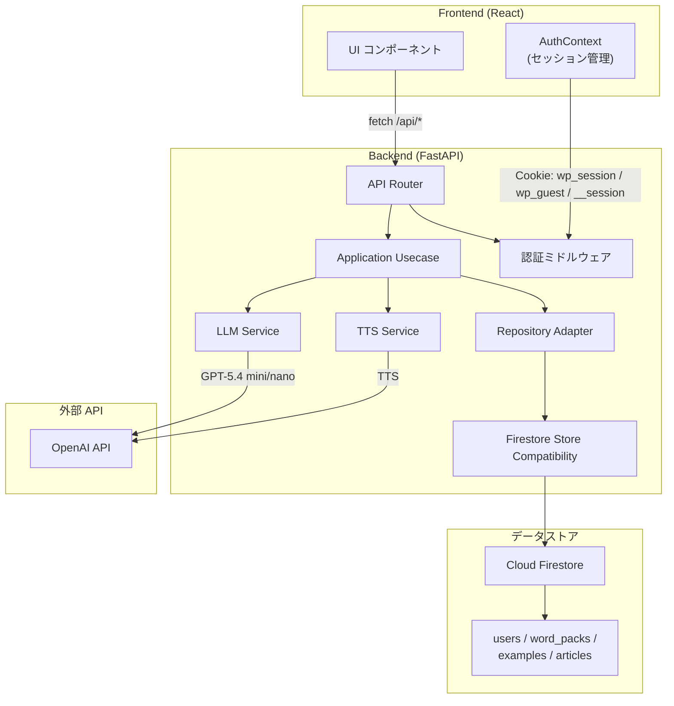

# インフラ構成図

WordPack for English のインフラ構成を示す。

---

## 本番環境（Production）



### コンポーネント説明

| コンポーネント | 役割 |
|---------------|------|
| **Firebase Hosting** | React + Vite でビルドした静的ファイルを配信。`/api/**` へのリクエストを Cloud Run へリライト。 |
| **Cloud Run** | FastAPI バックエンドを実行。`Dockerfile.backend` でビルドしたイメージをデプロイ。 |
| **Cloud Firestore** | ユーザー情報・WordPack・例文・インポート記事を永続化。ゲスト閲覧用のデモデータは `word_packs.metadata.guest_demo=true` で識別する。`firestore.indexes.json` で複合インデックスを管理。 |
| **Artifact Registry** | Cloud Build でビルドした Docker イメージを保存。 |
| **Cloud Load Balancer** | HTTPS 終端と `X-Forwarded-For` によるクライアント IP 復元。 |
| **OpenAI API** | WordPack 生成（gpt-5.4-mini）と音声読み上げ（gpt-4o-mini-tts）。 |
| **Google OAuth 2.0** | フロントエンドでの Google ログイン。バックエンドは `/api/config` でクライアント ID を配布し、受け取った ID トークンを検証してセッションを発行する。 |
| **Langfuse** | LLM のプロンプト・レスポンスをトレース（任意設定）。 |

---

## ローカル開発環境



### 起動コマンド

```bash
# Docker Compose で一括起動
docker compose up --build

# または個別起動
# Backend
python -m uvicorn backend.main:app --reload --app-dir apps/backend

# Frontend
cd apps/frontend && npm run dev
```

### Firestore 接続先

| 条件 | データストア | 用途 |
|-------------|-------------|------|
| `FIRESTORE_EMULATOR_HOST` あり | Firestore Emulator | ローカル開発 / CI |
| `FIRESTORE_EMULATOR_HOST` なし | Cloud Firestore | 本番 / 検証 |

`ENVIRONMENT` は認証やセキュリティ既定値に使い、Firestore の接続先切り替えには使わない。詳細は [docs/firestore.md](./firestore.md) を参照する。

---

## CI/CD パイプライン



### CI ジョブ一覧

| ジョブ名 | トリガー | 内容 |
|---------|---------|------|
| **Backend tests** | push / PR | `PYTHONPATH=apps/backend` で `pytest` を実行し、`pytest.ini` の `addopts` に揃えた `apps/backend/backend` のカバレッジが 60% 以上であることを検証 |
| **Security headers tests** | push / PR | セキュリティヘッダー検証（HSTS, CSP, etc.） |
| **Frontend tests** | push / PR | `vitest --coverage` によるフロントエンドテストと、lines/statements 80%、branches 70%、functions 66% のカバレッジ閾値チェック（functions は段階的に 70%→75%→80% へ引き上げ予定） |
| **Playwright smoke** | `pull_request`（Backend / Frontend テスト成功後） | Playwright の主要導線スモークテスト（`auth.spec.ts` / `guest.spec.ts` / `wordpack.spec.ts`） |
| **Visual regression** | `pull_request`（UI 変更のみ） | UI 変更が検知された場合に Playwright の視覚回帰 (`tests/e2e/visual.spec.ts`) を実行 |
| **Cloud Run config guard** | Security headers 成功後 | デプロイスクリプトの lint と dry-run 検証 |
| **Production deploy preflight** | `pull_request` / `pull_request_target` / 手動実行 | PR コードでは secrets なしの frontend build、Cloud Run dry-run、Hosting API plan を実行し、secrets を使う read-only probe は base branch の信頼済みコードだけで実行 |
| **Cloud Run dry-run** | `main` push | `CD / Cloud Run dry-run` として main に取り込まれた commit のチェック一覧に表示し、`make release-cloud-run` の dry-run モードを実行 |
| **Deploy to production** | `main` push / 手動実行 | `deploy-production.yml` が `make release-cloud-run` と Firebase Hosting deploy を実行。PR では本番デプロイ job を作らない |

Cloud Run dry-run と `Deploy to production` は `main` ブランチへの push で直接起動し、GitHub のコミットチェック一覧に CD の状態を表示する。PR では本番デプロイ job を作らず、`Production deploy preflight` で非破壊の事前検証を行う。CI 成功を必須にする場合は main ブランチ保護でチェックを必須化する。

CD のチェック表示は GitHub Actions に集約する。main への push または手動リリース時は `Deploy to production` ワークフローが起動し、その job の成功/失敗で本番デプロイの状態を確認する。Cloud Build は `cloudbuild.backend.yaml` でバックエンド image build のみを担当し、GitHub Checks API への通知は行わない。これにより Cloud Build 内の外部通知が詰まって Cloud Run デプロイ開始前に止まるリスクを避ける。

### E2E 実行レイヤ（Playwright）

Playwright の E2E は実行レイヤごとにスコープとブラウザを分離する。PR では最短のスモークのみを CI に含め、フル回帰は必要時に手動実行（workflow_dispatch）で起動する専用ワークフローで扱う。

| レイヤ | トリガー | ブラウザ | 実行コマンド | 成果物 |
|---|---|---|---|---|
| PR スモーク | `pull_request` | Chromium | `npx playwright test -c tests/e2e/playwright.config.ts tests/e2e/auth.spec.ts tests/e2e/guest.spec.ts tests/e2e/wordpack.spec.ts` | `playwright-report/`, `test-results/` |
| PR ビジュアル回帰 | `pull_request`（`apps/frontend/src/**`, `apps/frontend/**/*.css`, `apps/frontend/**/*.tsx` の変更時） | Chromium | `npx playwright test -c tests/e2e/playwright.config.ts tests/e2e/visual.spec.ts` | `playwright-report/`, `test-results/` |
| 手動回帰 | `workflow_dispatch` | Chromium | `npx playwright test -c tests/e2e/playwright.config.ts --browser=chromium` | `playwright-report/`, `test-results/` |

各レイヤの実行前に `npx playwright install --with-deps` を実行してブラウザを取得する。成果物は GitHub Actions の Artifacts として 90 日保持する。ビジュアル回帰の差分画像や HTML レポートは対象ワークフローの実行画面から `playwright-report/` と `test-results/` をダウンロードして確認する。

---

## デプロイフロー



### デプロイコマンド

```bash
# Firestore インデックス同期 → dry-run → 本番デプロイ
make release-cloud-run \
  PROJECT_ID=my-prod-project \
  REGION=asia-northeast1 \
  ENV_FILE=.env.deploy
```

---

## ネットワーク構成



### セキュリティ設定

| 設定項目 | 環境変数 | 説明 |
|---------|---------|------|
| **CORS** | `CORS_ALLOWED_ORIGINS` | 許可するフロントエンドオリジン |
| **信頼プロキシ** | `TRUSTED_PROXY_IPS` | X-Forwarded-For を信頼する CIDR |
| **許可ホスト** | `ALLOWED_HOSTS` | TrustedHostMiddleware で許可するホスト名 |
| **HSTS** | `SECURITY_HSTS_MAX_AGE_SECONDS` | HTTP Strict Transport Security の max-age |
| **CSP** | `SECURITY_CSP_DEFAULT_SRC` | Content Security Policy の default-src |

---

## データフロー



---

## 参照

- [README.md](../README.md) - プロダクト概要と最短起動
- [docs/環境変数の意味.md](./環境変数の意味.md) - 環境変数の一覧と説明
- [docs/deployment.md](./deployment.md) - Cloud Run / Firebase Hosting / GitHub Actions デプロイ手順
- [docs/firestore.md](./firestore.md) - Firestore インデックス、エミュレータ、シード、削除運用
- [docs/flows.md](./flows.md) - API フロー図
- [docs/models.md](./models.md) - データモデル定義
- [firestore.indexes.json](../firestore.indexes.json) - Firestore インデックス定義
