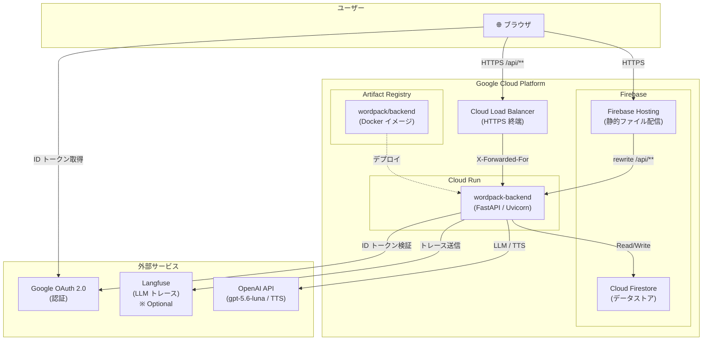
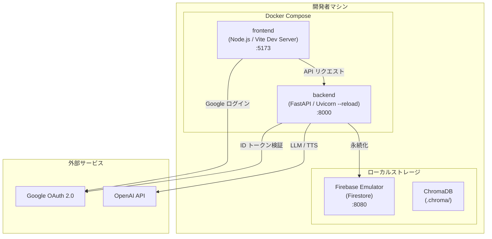
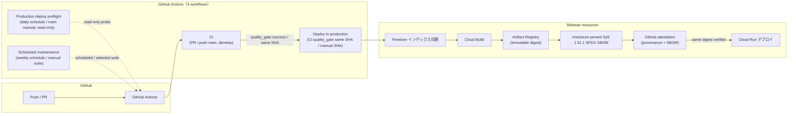
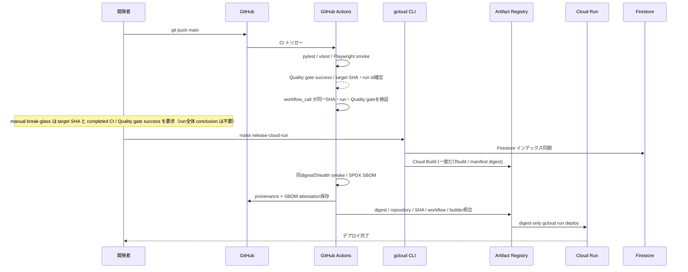
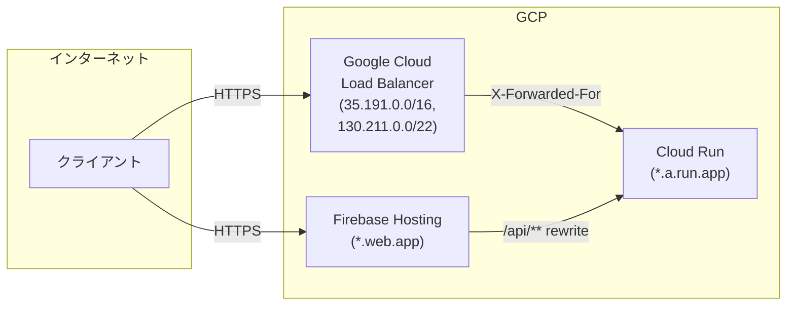
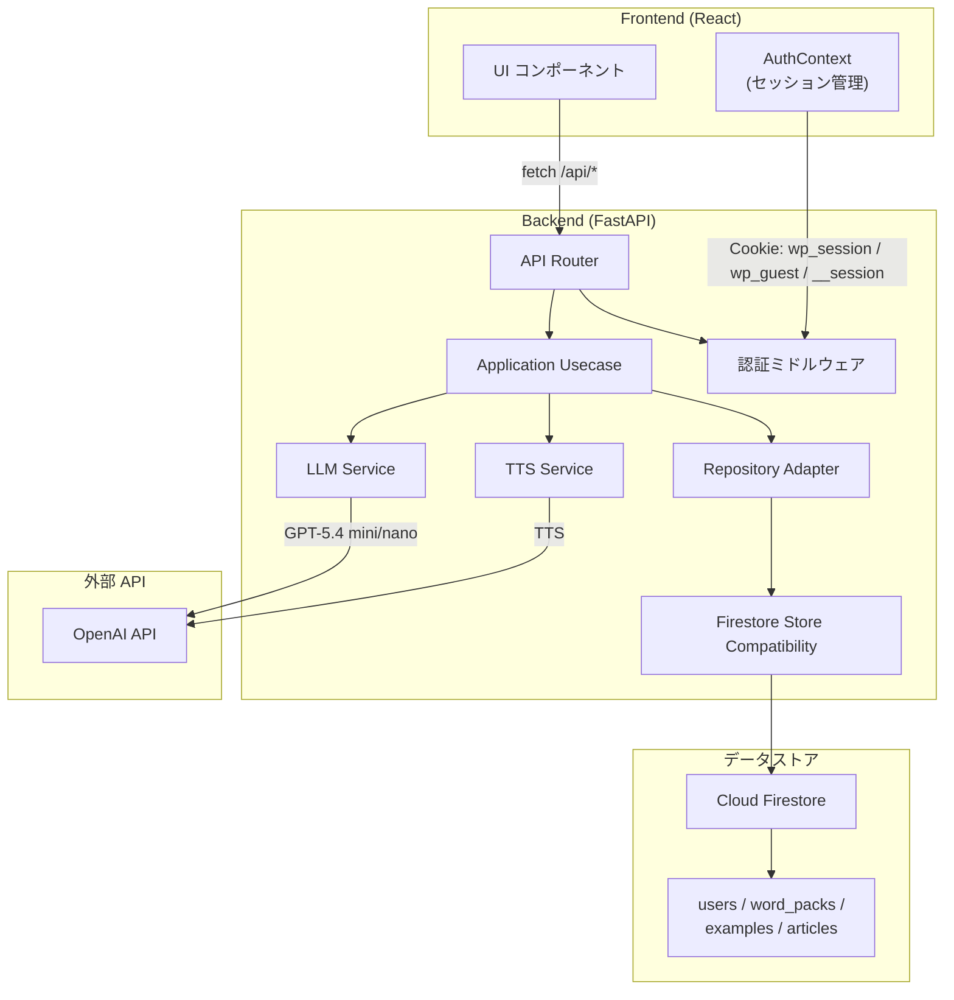

# インフラ構成図

WordPack for English のインフラ構成を示す。

---

## 本番環境（Production）


```mermaid
flowchart TB
    subgraph Users["ユーザー"]
        Browser["🌐 ブラウザ"]
    end

    subgraph GCP["Google Cloud Platform"]
        subgraph Firebase["Firebase"]
            Hosting["Firebase Hosting<br/>(静的ファイル配信)"]
            Firestore["Cloud Firestore<br/>(データストア)"]
        end

        subgraph CloudRun["Cloud Run"]
            Backend["wordpack-backend<br/>(FastAPI / Uvicorn)"]
        end

        subgraph ArtifactRegistry["Artifact Registry"]
            DockerImage["wordpack/backend<br/>(Docker イメージ)"]
        end

        LB["Cloud Load Balancer<br/>(HTTPS 終端)"]
    end

    subgraph External["外部サービス"]
        OpenAI["OpenAI API<br/>(gpt-5.6-luna / TTS)"]
        GoogleOAuth["Google OAuth 2.0<br/>(認証)"]
        Langfuse["Langfuse<br/>(LLM トレース)<br/>※ Optional"]
    end

    Browser -->|HTTPS| Hosting
    Browser -->|HTTPS /api/**| LB
    LB -->|X-Forwarded-For| Backend
    Hosting -->|rewrite /api/**| Backend
    Backend -->|Read/Write| Firestore
    Backend -->|LLM / TTS| OpenAI
    Backend -->|トレース送信| Langfuse
    Browser -->|ID トークン取得| GoogleOAuth
    Backend -->|ID トークン検証| GoogleOAuth
    DockerImage -.->|デプロイ| Backend
```

### コンポーネント説明

| コンポーネント | 役割 |
|---------------|------|
| **Firebase Hosting** | React + Vite でビルドした静的ファイルを配信。`/api/**` へのリクエストを Cloud Run へリライト。 |
| **Cloud Run** | FastAPI バックエンドを実行。既存のproduction workflowのbuild jobが対象SHAのprivate archiveを使って一度だけビルドし、health smoke・SBOM・provenanceを確認したimmutable digestをdeploy jobがデプロイ。 |
| **Cloud Firestore** | ユーザー情報・WordPack・例文・インポート記事を永続化。ゲスト閲覧用のデモデータは `word_packs.metadata.guest_demo=true` で識別する。`firestore.indexes.json` で複合インデックスを管理。 |
| **Artifact Registry** | Cloud Buildで一度だけビルドしたDockerイメージのmanifest digestとnative provenanceを保存。native provenanceはexact digestに対して取得・検証し、保持期間・failed artifactのcleanupは外部設定。 |
| **Cloud Load Balancer** | HTTPS 終端と `X-Forwarded-For` によるクライアント IP 復元。 |
| **OpenAI API** | WordPack 生成（gpt-5.6-luna）と音声読み上げ（gpt-4o-mini-tts）。 |
| **Google OAuth 2.0** | フロントエンドでの Google ログイン。バックエンドは `/api/config` でクライアント ID を配布し、受け取った ID トークンを検証してセッションを発行する。 |
| **Langfuse** | LLM のプロンプト・レスポンスをトレース（任意設定）。 |

---

## ローカル開発環境


```mermaid
flowchart TB
    subgraph Dev["開発者マシン"]
        subgraph DockerCompose["Docker Compose"]
            FrontendContainer["frontend<br/>(Node.js / Vite Dev Server)<br/>:5173"]
            BackendContainer["backend<br/>(FastAPI / Uvicorn --reload)<br/>:8000"]
        end

        subgraph Local["ローカルストレージ"]
            FirestoreEmulator["Firebase Emulator<br/>(Firestore)<br/>:8080"]
            ChromaDB["ChromaDB<br/>(.chroma/)"]
        end
    end

    subgraph External["外部サービス"]
        OpenAI["OpenAI API"]
        GoogleOAuth["Google OAuth 2.0"]
    end

    FrontendContainer -->|API リクエスト| BackendContainer
    BackendContainer -->|永続化| FirestoreEmulator
    BackendContainer -->|LLM / TTS| OpenAI
    FrontendContainer -->|Google ログイン| GoogleOAuth
    BackendContainer -->|ID トークン検証| GoogleOAuth
```

### 起動コマンド

```bash
# Docker Compose で一括起動
docker compose up --build

# または個別起動
# Backend
python -m uvicorn backend.main:app --reload --app-dir apps/backend

# Frontend
cd apps/frontend && npm run dev
```

### Firestore 接続先

| 条件 | データストア | 用途 |
|-------------|-------------|------|
| `FIRESTORE_EMULATOR_HOST` あり | Firestore Emulator | ローカル開発 / CI |
| `FIRESTORE_EMULATOR_HOST` なし | Cloud Firestore | 本番 / 検証 |

`ENVIRONMENT` は認証やセキュリティ既定値に使い、Firestore の接続先切り替えには使わない。詳細は [docs/firestore.md](./firestore.md) を参照する。

---

## CI/CD パイプライン

GitHub Actions は、`ci.yml`（PRと`main` / `develop` push）、`deploy-production.yml`（CI `quality_gate` 後の reusable call または手動指定SHA）、`production-deploy-preflight.yml`（daily schedule / main手動のread-only probe）、`scheduled-maintenance.yml`（weekly schedule / suite選択の手動実行）の4 workflowで構成する。


```mermaid
flowchart LR
    subgraph GitHub["GitHub"]
        Push["Push / PR"]
        Actions["GitHub Actions"]
    end

    subgraph Workflows["GitHub Actions（4 workflows）"]
        CI["CI<br/>(PR / push main, develop)"]
        ProductionDeploy["Deploy to production<br/>(CI quality_gate same SHA / manual SHA)"]
        DeployPreflight["Production deploy preflight<br/>(daily schedule / main manual, read-only)"]
        Maintenance["Scheduled maintenance<br/>(weekly schedule / manual suite)"]
    end

    subgraph CD["Release resources"]
        FirestoreIndex["Firestore インデックス同期"]
        CloudBuild["Cloud Build"]
        Registry["Artifact Registry<br/>(immutable digest)"]
        SBOM["checksum-pinned Syft 1.51.1 SPDX SBOM"]
        Attestation["GitHub attestation<br/>(provenance + SBOM)"]
        CloudRun["Cloud Run デプロイ"]
    end

    Push --> Actions --> CI
    CI -->|quality_gate success / same SHA| ProductionDeploy
    DeployPreflight -.->|read-only probe| Actions
    Maintenance -.->|scheduled / selected suite| Actions
    ProductionDeploy --> FirestoreIndex
    FirestoreIndex --> CloudBuild
    CloudBuild --> Registry
    Registry --> SBOM
    SBOM --> Attestation
    Attestation -->|same digest verified| CloudRun
```

### GitHub Actions ワークフロー一覧

| workflow | トリガー | 主な内容 |
|---------|---------|------|
| **CI** (`.github/workflows/ci.yml`) | `push`（`main` / `develop`） / `pull_request`（`main` / `develop`） | `verification_scope` で10出力を分類し、選択された検証、security text scan、`Quality gate`を実行 |
| **Deploy to production** (`.github/workflows/deploy-production.yml`) | `workflow_call`（CI main pushの`quality_gate`後、`target_sha` / `ci_run_id`） / `workflow_dispatch`（`target_sha`必須） | caller CIのrun・SHA・Quality gate成功を照合してからCloud Run canary / rollback / Firebase Hosting deployを実行 |
| **Production deploy preflight** (`.github/workflows/production-deploy-preflight.yml`) | daily schedule（`17 3 * * *`） / `workflow_dispatch`（main refのみ） | 信頼済みmain codeでgcloud、Firestore、Firebase Hostingのread-only probe。credential欠如はfail-closed |
| **Scheduled maintenance** (`.github/workflows/scheduled-maintenance.yml`) | weekly schedule（`0 3 * * 1`） / `workflow_dispatch`（`all` / `codeql` / `scorecard` / `backend-performance` / `playwright`） | CodeQL、OpenSSF Scorecard、backend performance、全Playwright回帰をsuite単位で実行 |

### CI ジョブ一覧

| ジョブ名 | トリガー | 内容 |
|---------|---------|------|
| **`verification_scope`** | push / PR | `scripts/classify_verification_inputs.py` が10出力を生成し、分類不能時はfail-fast |
| **`security_text_scan`** | すべてのCI | `scripts/security_scan_text.py` でsource textの不可視制御文字を検査 |
| **`dependency_review`** | dependency-bearing pathを含むPR | Dependency Graph probeとdependency reviewを実行。Graph利用不可はfail-closed |
| **`backend`** | classifier選択時、およびmain push | Python 3.14 + Firestore Emulatorでpytestとcoverageを実行。security headersもfull suiteに含む |
| **`backend_compatibility`** | backend選択のmain push | Python 3.13で同じpytest suiteを`--no-cov`実行 |
| **`frontend`** | classifier選択時 | typecheckとVitest。PR / developはno coverage、main pushはcoverage |
| **`backend_container`** | classifier選択時、およびmain push | Python 3.14 backend imageをbuildし、`/healthz`を確認 |
| **`deploy_preflight`** | classifier選択時、およびmain push | deploy contract test、shellcheck、Cloud Run dry-runを実行 |
| **`governance`** | governance選択時 | `validate_governance.py` の後にgovernance contract pytestを実行 |
| **`workflow_contract`** | workflow contract選択時 | workflow YAML parseとclassifier / scheduled-maintenance contract testを実行 |
| **Playwright smoke** | 中央classifierが選択した push / PR | 選択時だけ主要導線スモーク（`auth.spec.ts` / `guest.spec.ts` / `wordpack-server-query.spec.ts` / `wordpack.spec.ts`）を実行。前提失敗や予期しないskipは `Quality gate` で失敗扱い |
| **Visual regression** | 中央classifierが選択した push / PR | 選択時だけ `tests/e2e/visual.spec.ts` を実行。分類失敗や予期しないskipは `Quality gate` で失敗扱い |
| **Quality gate** | push / PR | 中央classifierの結果と、選択されたBackend／Frontend／deploy／Playwright smoke・visual等の結果を集約し、未選択jobの予期しない実行も含めてfail-closed |

静的な Cloud Run dry-run と deploy contract 検証は `CI` lane に集約し、重複する `deploy-dry-run.yml` workflow は置かない。本番デプロイは `CI` の `quality_gate` 後に同じrun内で reusable call し、called workflow が run metadata・同一SHA・Quality gate成功を再検証してから開始する。PR / develop push では caller jobをskipし、別の production runを作らない。認証済み probe は schedule または main ref の手動実行に限定する。backend artifactの処理は既存の `Deploy to production` workflow内で `prepare-release-artifacts`、`build-backend-artifact`、`attest-backend-artifact`、`deploy` の4 jobへ分離する。新しいworkflowは増やしていない。job-wide OIDC/permissionsを最小化し、Cloud Build・Syft・GitHub attestation・deploy SDKとsecretの依存を隔離し、credential cleanupとartifact handoffを明示するための分離である。

CD のチェック表示は GitHub Actions に集約する。CI の `deploy_production` caller jobは main push かつ `quality_gate` 成功時だけ local reusable workflowを呼び出し、called workflowの実ジョブが同じCI check suiteへ表示される。called workflowは `github.sha`、caller `ci_run_id`、CI workflow identity、main push、同一runの `Quality gate (selected checks)` 成功を検証する。manual break-glass は completed候補から1件確定した後、同じrunの詳細とjobs APIで指定 SHAの completed CI／`Quality gate (selected checks)` success を照合する。CI run 全体の conclusion は、automatic deploy failure が enclosing run を failure にしていても候補条件にしない。workflow再作成時のID変更はworkflow側の定数を明示更新する。`prepare-release-artifacts` はtarget SHAのcheckout、frontend build、1日retentionのfrontend artifactを担当する。`build-backend-artifact` は `scripts/build_backend_artifact.sh` が `git archive TARGET_SHA` で作るprivate temporary contextをCloud Buildへ一度だけsubmitし、build result と Artifact Registry manifest digestを照合する。`cloudbuild.backend.yaml` の `options.requestedVerifyOption: VERIFIED` でnative provenanceを独立要求し、`gcloud artifacts docker images describe <image>@<digest> --show-provenance --format=json` で同じexact digestから取得するJSONについて、image digest、GoogleHostedWorker、invocation、`_SOURCE_REPOSITORY` / `_TARGET_SHA` / `_BUILDER_WORKFLOW` substitutionsを検証する。local archiveではSCM metadataを省略でき、存在時はrepository/ref/SHAを照合する。検証済みJSONのSHA256を `nativeProvenanceSnapshotSha256` としてworkflow predicateへ結合し、同jobで同digestのhealth smokeと1日retentionのimage archiveをhandoffする。`attest-backend-artifact` は別runnerでexact imageをloadし、Google credentialを持たずにchecksum-pinned Syft 1.51.1 CLIで SPDX 2.3 SBOMを生成し、GitHub APIへcustom SLSA provenance attestationとSBOMを保存する。Anchore Actionは使わない。`deploy` はGCPへWIFで再認証してprivate GAR向けDocker authを設定した後、`gh attestation verify` を同じdigestへ実行し、成功してからsecret materialize、Cloud Run、traffic、Hosting writeへ進む。GitHub verificationの `--source-digest` はattestation certificateのsource repository digest（`github.sha`）、`--signer-digest` はworkflow file revision（`github.workflow_sha`）であり、build対象 `TARGET_SHA` はcustom predicate内で別に固定する。GitHub workflow-level attestationのbuilder値はdeploy workflow URIで、`underlyingBuilder`は独立して要求したCloud Build native provenanceとの対応を示すpredicate値です。GitHub署名者identityがGoogle builder identityを代替するわけではありません。GitHub Checks APIへの通知やPRからのpublishは行いません。

Cloud Buildへのlocal source stagingはtarget SHA内の `.gcloudignore` allowlistでDockerfile、build config、requirements、backend runtime sourceだけへ限定する。native provenanceはSCM `buildConfigSource` または空でないinline `buildConfig` のちょうど一方を必要とし、どちらもない形状を拒否する。

### backend artifact の信頼境界と保持

`target_sha`、Cloud Buildのbuild result、Artifact Registryのmanifest digest、health smokeの対象、SBOM、GitHub attestation、native provenance JSONのSHA256、Cloud Run deploy引数がbackend releaseの証跡です。Cloud Runにはタグではなく検証済みdigestを渡し、どの比較にも失敗した場合はtraffic変更へ進みません。GitHub attestationは対象repositoryのAPI storage、imageとCloud Build native provenanceはArtifact Registry / Cloud Build側の保持設定が正本です。frontend release、backend image archive、attestation metadataのhandoff artifactはworkflowで各1日だけ保持します。保持日数、failed buildのtag・manifest cleanup、SBOM/attestationの削除可否は外部設定としてinventoryし、リポジトリの静的テストはそのlive状態を証明しません。helperの出力はimage name/URI/digestと `native_provenance_snapshot_sha256` だけで、build IDは内部照合に限定して公開しません。native provenance readには `containeranalysis.googleapis.com` と project-level `roles/containeranalysis.occurrences.viewer` が必要です。

この処理は4 job分離、artifact転送、Cloud Build、Syft生成、attestation検証のためrunner wall time、Cloud Build quota、GitHub/Artifact Registry保存量を増やします。production environmentの承認は通常 `build-backend-artifact` と `deploy` の各jobで発生し得ます（identity-only手動経路も同environmentでWIF交換だけを確認します）。release operatorが一次failure ownerで、build/IAMはbuild担当、SPDX/attestationはsecurity/release担当、Cloud Run/Hosting/canary/rollbackはdeploy担当が停止箇所とcleanupを切り分けます。失敗時はworkspace、private archive、一時env、SBOM、credentialをcleanupし、rollbackに必要なhealthy revisionとdigestは保持します。ActionsのDependabot更新はfull SHA pin、attestation権限、subject digest、Syft checksum、1日retentionの入力をworkflow contractで再確認します。

job分離のsunsetまたはdemotionは自動で行いません。承認済みリリースの安定実績、1日artifact cleanup、runner/Cloud Build quota/GitHub・Artifact Registry storageの測定、job-wide OIDCと依存tool隔離が不要になったことをIssue/PRで証跡化し、digest、source/signer/target境界、attestation、rollback、credential cleanupを保った設計へ置換できる場合だけ変更します。Syft、native provenance、GitHub attestationの失敗が続く場合は `PRODUCTION_DEPLOY_ENABLED` を無効化してfail closedとし、検証を省略するdemotionは行いません。

### E2E 実行レイヤ（Playwright）

Playwright の E2E は実行レイヤごとにスコープとブラウザを分離する。CI の中央classifier（`scripts/classify_verification_inputs.py`）が変更範囲から smoke と visual の選択を決め、選択されたjobだけを実行する。フル回帰は週次または手動の専用workflowで扱う。

| レイヤ | トリガー | ブラウザ | 実行コマンド | 成果物 |
|---|---|---|---|---|
| 選択時スモーク | 中央classifierが選択した push / PR | Chromium | `npx playwright test -c tests/e2e/playwright.config.ts tests/e2e/auth.spec.ts tests/e2e/guest.spec.ts tests/e2e/wordpack-server-query.spec.ts tests/e2e/wordpack.spec.ts` | failure時のみ `playwright-report/`, `test-results/` |
| 選択時ビジュアル回帰 | 中央classifierが選択した push / PR | Chromium | `npx playwright test -c tests/e2e/playwright.config.ts tests/e2e/visual.spec.ts` | failure時のみ `playwright-report/`, `test-results/` |
| 手動回帰 | `workflow_dispatch` | Chromium | `npx playwright test -c tests/e2e/playwright.config.ts --browser=chromium` | `playwright-report/`, `test-results/` |

各レイヤの実行前に `npx playwright install --with-deps` を実行してブラウザを取得する。smoke／visual／週次回帰の成果物は failure 時だけ GitHub Actions Artifacts へ保存し、保持期間は 14 日とする。ビジュアル回帰の差分画像や HTML レポートは対象workflowの実行画面から確認する。

PRとpushの変更path分類は `scripts/classify_verification_inputs.py` に集約する。CI workflowは常に分類を実行し、対象jobを選択的に起動する。`Quality gate` はclassifier失敗、選択jobの失敗、前提失敗によるskipを成功扱いにしない。main pushでは `--full` の分類によりデプロイ前提の検証を選択する。

branch rulesで選択検証をrequiredにする場合は、個別のPlaywright jobではなく `Quality gate` を対象にする。Quality gateがclassifierと選択されたsmoke／visualを含む全選択結果を集約し、対象外だけを明示的skipとして許容する。

---

## デプロイフロー


```mermaid
sequenceDiagram
    participant Dev as 開発者
    participant GitHub as GitHub
    participant Actions as GitHub Actions
    participant GCloud as gcloud CLI
    participant AR as Artifact Registry
    participant CR as Cloud Run
    participant FS as Firestore

    Dev->>GitHub: git push main
    GitHub->>Actions: CI トリガー
    Actions->>Actions: pytest / vitest / Playwright smoke
    Actions-->>Actions: Quality gate success / target SHA・run id確定
    Actions->>Actions: workflow_call が同一SHA・run・Quality gateを検証

    Note over Dev: manual break-glass は target SHA と completed CI / Quality gate success を要求（run全体 conclusion は不要）
    Dev->>GCloud: make release-cloud-run
    GCloud->>FS: Firestore インデックス同期
    GCloud->>AR: Cloud Build (一度だけbuild / manifest digest)
    Actions->>Actions: 同digestのhealth smoke / SPDX SBOM
    Actions->>GitHub: provenance + SBOM attestation保存
    Actions->>AR: digest / repository / SHA / workflow / builder照合
    AR->>CR: digest-only gcloud run deploy
    CR-->>Dev: デプロイ完了
```

### デプロイコマンド

```bash
# Firestore インデックス同期 → dry-run → 本番デプロイ
make release-cloud-run \
  PROJECT_ID=my-prod-project \
  REGION=asia-northeast1 \
  ENV_FILE=.env.deploy \
  IMAGE_URI=<region>-docker.pkg.dev/<project-id>/wordpack/backend@sha256:<64-hex>
```

Cloud Buildのbuild service accountは、`build-backend-artifact` がprivate archiveのbuild-once段階でだけ使います。Google credentialはattest jobのSyft・actions/attest前にbuild jobから削除し、Syft 1.51.1はlocal Docker daemonへpull済みのexact digestを使います。attestation検証前にGoogle credentialを持たず、`deploy` がprivate GAR向け `gh attestation verify` の直前にWIFで再認証します。`make release-cloud-run` と `scripts/deploy_cloud_run.sh` は検証済みdigestを受け取り、タグ解決や再buildを行いません。native provenance readに必要な `containeranalysis.googleapis.com` は有効化済みで、deploy service accountには project-level `roles/containeranalysis.occurrences.viewer` を付与済みです（実値は外部設定として記録しません）。

---

## ネットワーク構成


```mermaid
flowchart LR
    subgraph Internet["インターネット"]
        Client["クライアント"]
    end

    subgraph GCP["GCP"]
        GLB["Google Cloud<br/>Load Balancer<br/>(35.191.0.0/16,<br/>130.211.0.0/22)"]
        Hosting["Firebase Hosting<br/>(*.web.app)"]
        CR["Cloud Run<br/>(*.a.run.app)"]
    end

    Client -->|HTTPS| GLB
    GLB -->|X-Forwarded-For| CR
    Client -->|HTTPS| Hosting
    Hosting -->|/api/** rewrite| CR
```

### セキュリティ設定

| 設定項目 | 環境変数 | 説明 |
|---------|---------|------|
| **CORS** | `CORS_ALLOWED_ORIGINS` | 許可するフロントエンドオリジン |
| **信頼プロキシ** | `TRUSTED_PROXY_IPS` | X-Forwarded-For を信頼する CIDR |
| **許可ホスト** | `ALLOWED_HOSTS` | TrustedHostMiddleware で許可するホスト名 |
| **HSTS** | `SECURITY_HSTS_MAX_AGE_SECONDS` | HTTP Strict Transport Security の max-age |
| **CSP** | `SECURITY_CSP_DEFAULT_SRC` | Content Security Policy の default-src |

---

## データフロー


```mermaid
flowchart TB
    subgraph Frontend["Frontend (React)"]
        UI["UI コンポーネント"]
        AuthContext["AuthContext<br/>(セッション管理)"]
    end

    subgraph Backend["Backend (FastAPI)"]
        Router["API Router"]
        Usecase["Application Usecase"]
        Auth["認証ミドルウェア"]
        LLMService["LLM Service"]
        TTSService["TTS Service"]
        Repository["Repository Adapter"]
        Store["Firestore Store Compatibility"]
    end

    subgraph Data["データストア"]
        Firestore["Cloud Firestore"]
        Collections["users / word_packs /<br/>examples / articles"]
    end

    subgraph External["外部 API"]
        OpenAI["OpenAI API"]
    end

    UI -->|fetch /api/*| Router
    Router --> Auth
    Router --> Usecase
    Usecase --> LLMService
    Usecase --> TTSService
    Usecase --> Repository
    Repository --> Store
    LLMService -->|GPT-5.4 mini/nano| OpenAI
    TTSService -->|TTS| OpenAI
    Store --> Firestore
    Firestore --> Collections
    AuthContext -->|Cookie: wp_session / wp_guest / __session| Auth
```

---

## 参照

- [README.md](../README.md) - プロダクト概要と最短起動
- [docs/環境変数の意味.md](./環境変数の意味.md) - 環境変数の一覧と説明
- [docs/deployment.md](./deployment.md) - Cloud Run / Firebase Hosting / GitHub Actions デプロイ手順
- [docs/firestore.md](./firestore.md) - Firestore インデックス、エミュレータ、シード、削除運用
- [docs/flows.md](./flows.md) - API フロー図
- [docs/models.md](./models.md) - データモデル定義
- [firestore.indexes.json](../firestore.indexes.json) - Firestore インデックス定義
