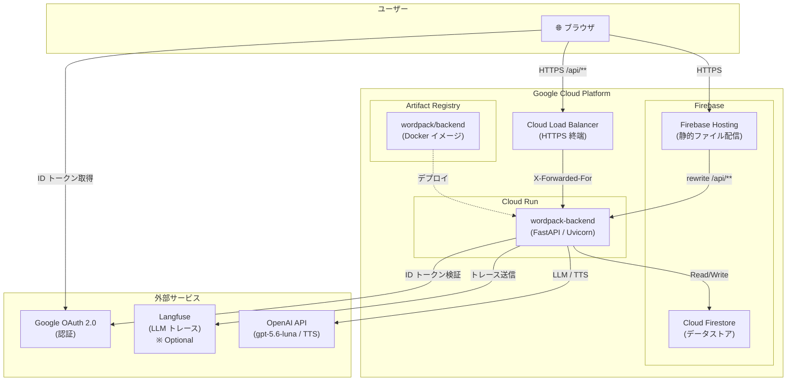
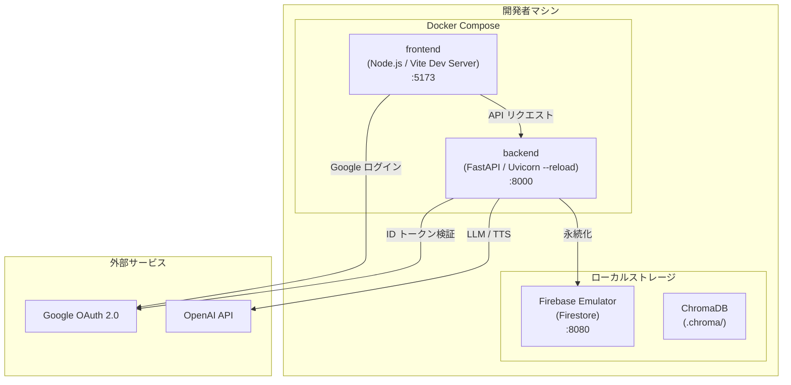
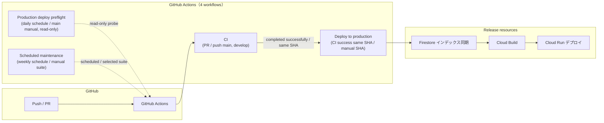
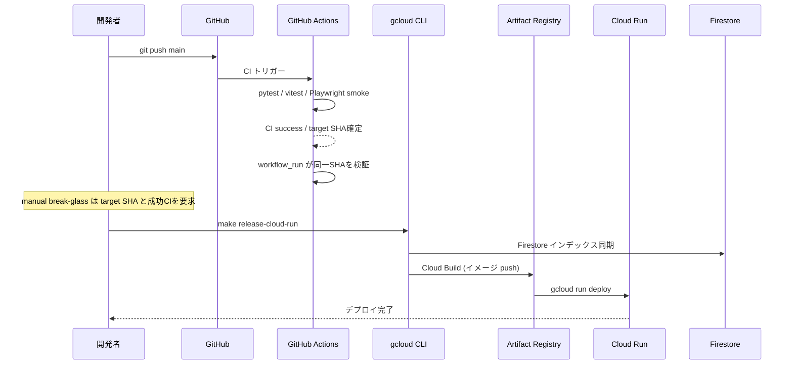
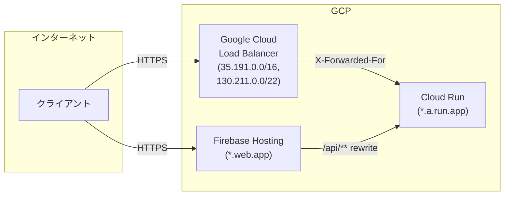
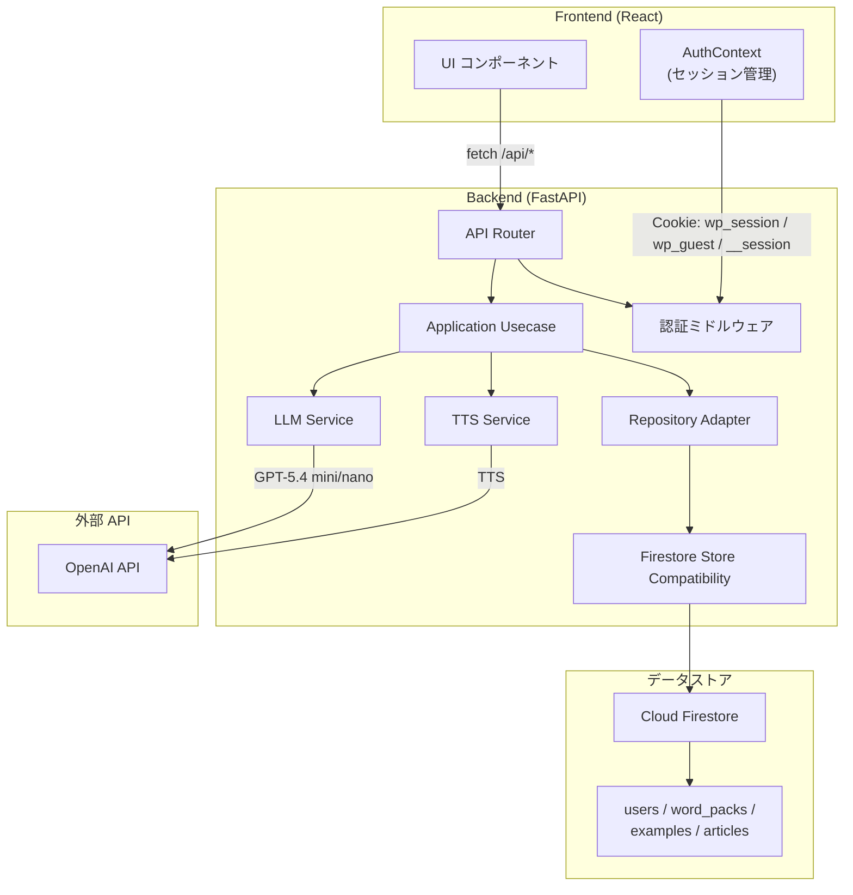

# インフラ構成図

WordPack for English のインフラ構成を示す。

---

## 本番環境（Production）


```mermaid
flowchart TB
    subgraph Users["ユーザー"]
        Browser["🌐 ブラウザ"]
    end

    subgraph GCP["Google Cloud Platform"]
        subgraph Firebase["Firebase"]
            Hosting["Firebase Hosting<br/>(静的ファイル配信)"]
            Firestore["Cloud Firestore<br/>(データストア)"]
        end

        subgraph CloudRun["Cloud Run"]
            Backend["wordpack-backend<br/>(FastAPI / Uvicorn)"]
        end

        subgraph ArtifactRegistry["Artifact Registry"]
            DockerImage["wordpack/backend<br/>(Docker イメージ)"]
        end

        LB["Cloud Load Balancer<br/>(HTTPS 終端)"]
    end

    subgraph External["外部サービス"]
        OpenAI["OpenAI API<br/>(gpt-5.6-luna / TTS)"]
        GoogleOAuth["Google OAuth 2.0<br/>(認証)"]
        Langfuse["Langfuse<br/>(LLM トレース)<br/>※ Optional"]
    end

    Browser -->|HTTPS| Hosting
    Browser -->|HTTPS /api/**| LB
    LB -->|X-Forwarded-For| Backend
    Hosting -->|rewrite /api/**| Backend
    Backend -->|Read/Write| Firestore
    Backend -->|LLM / TTS| OpenAI
    Backend -->|トレース送信| Langfuse
    Browser -->|ID トークン取得| GoogleOAuth
    Backend -->|ID トークン検証| GoogleOAuth
    DockerImage -.->|デプロイ| Backend
```

### コンポーネント説明

| コンポーネント | 役割 |
|---------------|------|
| **Firebase Hosting** | React + Vite でビルドした静的ファイルを配信。`/api/**` へのリクエストを Cloud Run へリライト。 |
| **Cloud Run** | FastAPI バックエンドを実行。`Dockerfile.backend` でビルドしたイメージをデプロイ。 |
| **Cloud Firestore** | ユーザー情報・WordPack・例文・インポート記事を永続化。ゲスト閲覧用のデモデータは `word_packs.metadata.guest_demo=true` で識別する。`firestore.indexes.json` で複合インデックスを管理。 |
| **Artifact Registry** | Cloud Build でビルドした Docker イメージを保存。 |
| **Cloud Load Balancer** | HTTPS 終端と `X-Forwarded-For` によるクライアント IP 復元。 |
| **OpenAI API** | WordPack 生成（gpt-5.6-luna）と音声読み上げ（gpt-4o-mini-tts）。 |
| **Google OAuth 2.0** | フロントエンドでの Google ログイン。バックエンドは `/api/config` でクライアント ID を配布し、受け取った ID トークンを検証してセッションを発行する。 |
| **Langfuse** | LLM のプロンプト・レスポンスをトレース（任意設定）。 |

---

## ローカル開発環境


```mermaid
flowchart TB
    subgraph Dev["開発者マシン"]
        subgraph DockerCompose["Docker Compose"]
            FrontendContainer["frontend<br/>(Node.js / Vite Dev Server)<br/>:5173"]
            BackendContainer["backend<br/>(FastAPI / Uvicorn --reload)<br/>:8000"]
        end

        subgraph Local["ローカルストレージ"]
            FirestoreEmulator["Firebase Emulator<br/>(Firestore)<br/>:8080"]
            ChromaDB["ChromaDB<br/>(.chroma/)"]
        end
    end

    subgraph External["外部サービス"]
        OpenAI["OpenAI API"]
        GoogleOAuth["Google OAuth 2.0"]
    end

    FrontendContainer -->|API リクエスト| BackendContainer
    BackendContainer -->|永続化| FirestoreEmulator
    BackendContainer -->|LLM / TTS| OpenAI
    FrontendContainer -->|Google ログイン| GoogleOAuth
    BackendContainer -->|ID トークン検証| GoogleOAuth
```

### 起動コマンド

```bash
# Docker Compose で一括起動
docker compose up --build

# または個別起動
# Backend
python -m uvicorn backend.main:app --reload --app-dir apps/backend

# Frontend
cd apps/frontend && npm run dev
```

### Firestore 接続先

| 条件 | データストア | 用途 |
|-------------|-------------|------|
| `FIRESTORE_EMULATOR_HOST` あり | Firestore Emulator | ローカル開発 / CI |
| `FIRESTORE_EMULATOR_HOST` なし | Cloud Firestore | 本番 / 検証 |

`ENVIRONMENT` は認証やセキュリティ既定値に使い、Firestore の接続先切り替えには使わない。詳細は [docs/firestore.md](./firestore.md) を参照する。

---

## CI/CD パイプライン

GitHub Actions は、`ci.yml`（PRと`main` / `develop` push）、`deploy-production.yml`（CI成功の同一SHAまたは手動指定SHA）、`production-deploy-preflight.yml`（daily schedule / main手動のread-only probe）、`scheduled-maintenance.yml`（weekly schedule / suite選択の手動実行）の4 workflowで構成する。


```mermaid
flowchart LR
    subgraph GitHub["GitHub"]
        Push["Push / PR"]
        Actions["GitHub Actions"]
    end

    subgraph Workflows["GitHub Actions（4 workflows）"]
        CI["CI<br/>(PR / push main, develop)"]
        ProductionDeploy["Deploy to production<br/>(CI success same SHA / manual SHA)"]
        DeployPreflight["Production deploy preflight<br/>(daily schedule / main manual, read-only)"]
        Maintenance["Scheduled maintenance<br/>(weekly schedule / manual suite)"]
    end

    subgraph CD["Release resources"]
        FirestoreIndex["Firestore インデックス同期"]
        CloudBuild["Cloud Build"]
        CloudRun["Cloud Run デプロイ"]
    end

    Push --> Actions --> CI
    CI -->|completed successfully / same SHA| ProductionDeploy
    DeployPreflight -.->|read-only probe| Actions
    Maintenance -.->|scheduled / selected suite| Actions
    ProductionDeploy --> FirestoreIndex
    FirestoreIndex --> CloudBuild
    CloudBuild --> CloudRun
```

### GitHub Actions ワークフロー一覧

| workflow | トリガー | 主な内容 |
|---------|---------|------|
| **CI** (`.github/workflows/ci.yml`) | `push`（`main` / `develop`） / `pull_request`（`main` / `develop`） | `verification_scope` で10出力を分類し、選択された検証、security text scan、`Quality gate`を実行 |
| **Deploy to production** (`.github/workflows/deploy-production.yml`) | `CI`の`workflow_run`（completed） / `workflow_dispatch`（`target_sha`必須） | CI成功と同一SHAを照合してからCloud Run canary / rollback / Firebase Hosting deployを実行 |
| **Production deploy preflight** (`.github/workflows/production-deploy-preflight.yml`) | daily schedule（`17 3 * * *`） / `workflow_dispatch`（main refのみ） | 信頼済みmain codeでgcloud、Firestore、Firebase Hostingのread-only probe。credential欠如はfail-closed |
| **Scheduled maintenance** (`.github/workflows/scheduled-maintenance.yml`) | weekly schedule（`0 3 * * 1`） / `workflow_dispatch`（`all` / `codeql` / `scorecard` / `backend-performance` / `playwright`） | CodeQL、OpenSSF Scorecard、backend performance、全Playwright回帰をsuite単位で実行 |

### CI ジョブ一覧

| ジョブ名 | トリガー | 内容 |
|---------|---------|------|
| **`verification_scope`** | push / PR | `scripts/classify_verification_inputs.py` が10出力を生成し、分類不能時はfail-fast |
| **`security_text_scan`** | すべてのCI | `scripts/security_scan_text.py` でsource textの不可視制御文字を検査 |
| **`dependency_review`** | dependency-bearing pathを含むPR | Dependency Graph probeとdependency reviewを実行。Graph利用不可はfail-closed |
| **`backend`** | classifier選択時、およびmain push | Python 3.14 + Firestore Emulatorでpytestとcoverageを実行。security headersもfull suiteに含む |
| **`backend_compatibility`** | backend選択のmain push | Python 3.13で同じpytest suiteを`--no-cov`実行 |
| **`frontend`** | classifier選択時 | typecheckとVitest。PR / developはno coverage、main pushはcoverage |
| **`backend_container`** | classifier選択時、およびmain push | Python 3.14 backend imageをbuildし、`/healthz`を確認 |
| **`deploy_preflight`** | classifier選択時、およびmain push | deploy contract test、shellcheck、Cloud Run dry-runを実行 |
| **`governance`** | governance選択時 | `validate_governance.py` の後にgovernance contract pytestを実行 |
| **`workflow_contract`** | workflow contract選択時 | workflow YAML parseとclassifier / scheduled-maintenance contract testを実行 |
| **Playwright smoke** | 中央classifierが選択した push / PR | 選択時だけ主要導線スモーク（`auth.spec.ts` / `guest.spec.ts` / `wordpack-server-query.spec.ts` / `wordpack.spec.ts`）を実行。前提失敗や予期しないskipは `Quality gate` で失敗扱い |
| **Visual regression** | 中央classifierが選択した push / PR | 選択時だけ `tests/e2e/visual.spec.ts` を実行。分類失敗や予期しないskipは `Quality gate` で失敗扱い |
| **Quality gate** | push / PR | 中央classifierの結果と、選択されたBackend／Frontend／deploy／Playwright smoke・visual等の結果を集約し、未選択jobの予期しない実行も含めてfail-closed |

静的な Cloud Run dry-run と deploy contract 検証は `CI` lane に集約し、重複する `deploy-dry-run.yml` workflow は置かない。本番デプロイは `CI` の同一SHA成功を `workflow_run` 側で再検証してから開始する。PR では本番デプロイ job を作らず、認証済み probe は schedule または main ref の手動実行に限定する。

CD のチェック表示は GitHub Actions に集約する。`workflow_run` は検証済み `workflow_run.head_sha` を checkout し、manual break-glass は completed候補から1件確定した後、同じrunの詳細とjobs APIで指定 SHAの成功CI／`Quality gate`を照合する。workflow再作成時のID変更はworkflow側の定数を明示更新する。Cloud Build は `cloudbuild.backend.yaml` でバックエンド image build のみを担当し、GitHub Checks API への通知は行わない。これにより Cloud Build 内の外部通知が詰まって Cloud Run デプロイ開始前に止まるリスクを避ける。

### E2E 実行レイヤ（Playwright）

Playwright の E2E は実行レイヤごとにスコープとブラウザを分離する。CI の中央classifier（`scripts/classify_verification_inputs.py`）が変更範囲から smoke と visual の選択を決め、選択されたjobだけを実行する。フル回帰は週次または手動の専用workflowで扱う。

| レイヤ | トリガー | ブラウザ | 実行コマンド | 成果物 |
|---|---|---|---|---|
| 選択時スモーク | 中央classifierが選択した push / PR | Chromium | `npx playwright test -c tests/e2e/playwright.config.ts tests/e2e/auth.spec.ts tests/e2e/guest.spec.ts tests/e2e/wordpack-server-query.spec.ts tests/e2e/wordpack.spec.ts` | failure時のみ `playwright-report/`, `test-results/` |
| 選択時ビジュアル回帰 | 中央classifierが選択した push / PR | Chromium | `npx playwright test -c tests/e2e/playwright.config.ts tests/e2e/visual.spec.ts` | failure時のみ `playwright-report/`, `test-results/` |
| 手動回帰 | `workflow_dispatch` | Chromium | `npx playwright test -c tests/e2e/playwright.config.ts --browser=chromium` | `playwright-report/`, `test-results/` |

各レイヤの実行前に `npx playwright install --with-deps` を実行してブラウザを取得する。smoke／visual／週次回帰の成果物は failure 時だけ GitHub Actions Artifacts へ保存し、保持期間は 14 日とする。ビジュアル回帰の差分画像や HTML レポートは対象workflowの実行画面から確認する。

PRとpushの変更path分類は `scripts/classify_verification_inputs.py` に集約する。CI workflowは常に分類を実行し、対象jobを選択的に起動する。`Quality gate` はclassifier失敗、選択jobの失敗、前提失敗によるskipを成功扱いにしない。main pushでは `--full` の分類によりデプロイ前提の検証を選択する。

branch rulesで選択検証をrequiredにする場合は、個別のPlaywright jobではなく `Quality gate` を対象にする。Quality gateがclassifierと選択されたsmoke／visualを含む全選択結果を集約し、対象外だけを明示的skipとして許容する。

---

## デプロイフロー


```mermaid
sequenceDiagram
    participant Dev as 開発者
    participant GitHub as GitHub
    participant Actions as GitHub Actions
    participant GCloud as gcloud CLI
    participant AR as Artifact Registry
    participant CR as Cloud Run
    participant FS as Firestore

    Dev->>GitHub: git push main
    GitHub->>Actions: CI トリガー
    Actions->>Actions: pytest / vitest / Playwright smoke
    Actions-->>Actions: CI success / target SHA確定
    Actions->>Actions: workflow_run が同一SHAを検証

    Note over Dev: manual break-glass は target SHA と成功CIを要求
    Dev->>GCloud: make release-cloud-run
    GCloud->>FS: Firestore インデックス同期
    GCloud->>AR: Cloud Build (イメージ push)
    AR->>CR: gcloud run deploy
    CR-->>Dev: デプロイ完了
```

### デプロイコマンド

```bash
# Firestore インデックス同期 → dry-run → 本番デプロイ
make release-cloud-run \
  PROJECT_ID=my-prod-project \
  REGION=asia-northeast1 \
  ENV_FILE=.env.deploy
```

---

## ネットワーク構成


```mermaid
flowchart LR
    subgraph Internet["インターネット"]
        Client["クライアント"]
    end

    subgraph GCP["GCP"]
        GLB["Google Cloud<br/>Load Balancer<br/>(35.191.0.0/16,<br/>130.211.0.0/22)"]
        Hosting["Firebase Hosting<br/>(*.web.app)"]
        CR["Cloud Run<br/>(*.a.run.app)"]
    end

    Client -->|HTTPS| GLB
    GLB -->|X-Forwarded-For| CR
    Client -->|HTTPS| Hosting
    Hosting -->|/api/** rewrite| CR
```

### セキュリティ設定

| 設定項目 | 環境変数 | 説明 |
|---------|---------|------|
| **CORS** | `CORS_ALLOWED_ORIGINS` | 許可するフロントエンドオリジン |
| **信頼プロキシ** | `TRUSTED_PROXY_IPS` | X-Forwarded-For を信頼する CIDR |
| **許可ホスト** | `ALLOWED_HOSTS` | TrustedHostMiddleware で許可するホスト名 |
| **HSTS** | `SECURITY_HSTS_MAX_AGE_SECONDS` | HTTP Strict Transport Security の max-age |
| **CSP** | `SECURITY_CSP_DEFAULT_SRC` | Content Security Policy の default-src |

---

## データフロー


```mermaid
flowchart TB
    subgraph Frontend["Frontend (React)"]
        UI["UI コンポーネント"]
        AuthContext["AuthContext<br/>(セッション管理)"]
    end

    subgraph Backend["Backend (FastAPI)"]
        Router["API Router"]
        Usecase["Application Usecase"]
        Auth["認証ミドルウェア"]
        LLMService["LLM Service"]
        TTSService["TTS Service"]
        Repository["Repository Adapter"]
        Store["Firestore Store Compatibility"]
    end

    subgraph Data["データストア"]
        Firestore["Cloud Firestore"]
        Collections["users / word_packs /<br/>examples / articles"]
    end

    subgraph External["外部 API"]
        OpenAI["OpenAI API"]
    end

    UI -->|fetch /api/*| Router
    Router --> Auth
    Router --> Usecase
    Usecase --> LLMService
    Usecase --> TTSService
    Usecase --> Repository
    Repository --> Store
    LLMService -->|GPT-5.4 mini/nano| OpenAI
    TTSService -->|TTS| OpenAI
    Store --> Firestore
    Firestore --> Collections
    AuthContext -->|Cookie: wp_session / wp_guest / __session| Auth
```

---

## 参照

- [README.md](../README.md) - プロダクト概要と最短起動
- [docs/環境変数の意味.md](./環境変数の意味.md) - 環境変数の一覧と説明
- [docs/deployment.md](./deployment.md) - Cloud Run / Firebase Hosting / GitHub Actions デプロイ手順
- [docs/firestore.md](./firestore.md) - Firestore インデックス、エミュレータ、シード、削除運用
- [docs/flows.md](./flows.md) - API フロー図
- [docs/models.md](./models.md) - データモデル定義
- [firestore.indexes.json](../firestore.indexes.json) - Firestore インデックス定義
