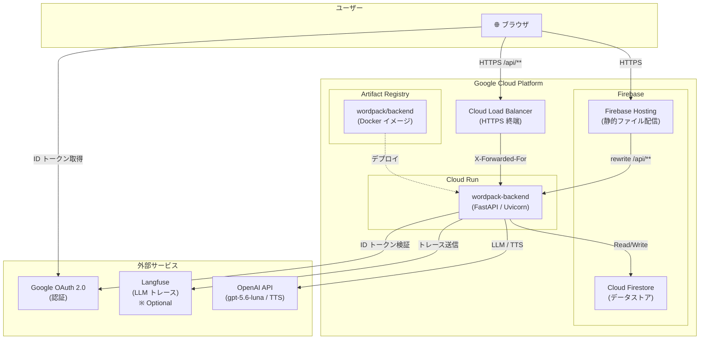
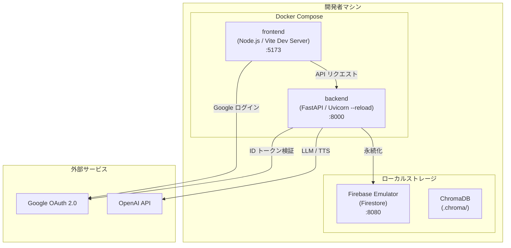
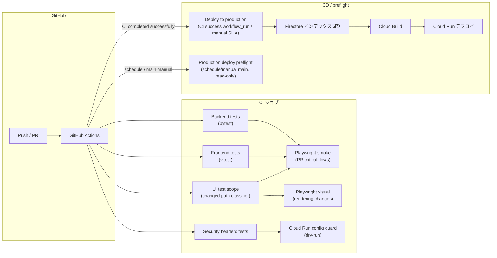
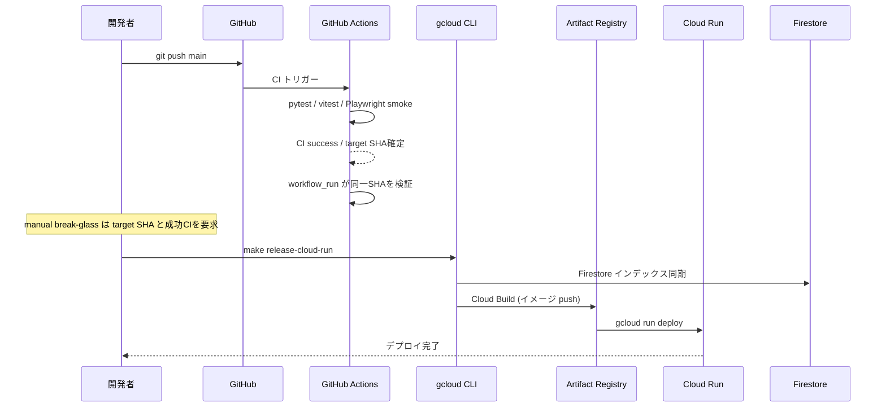
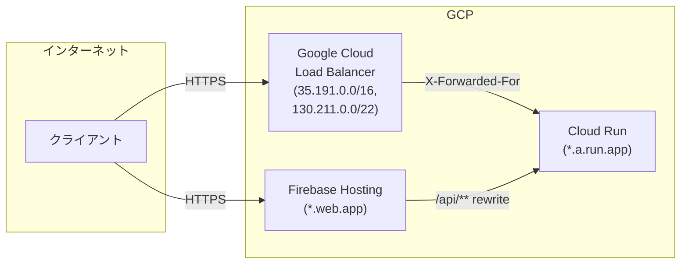
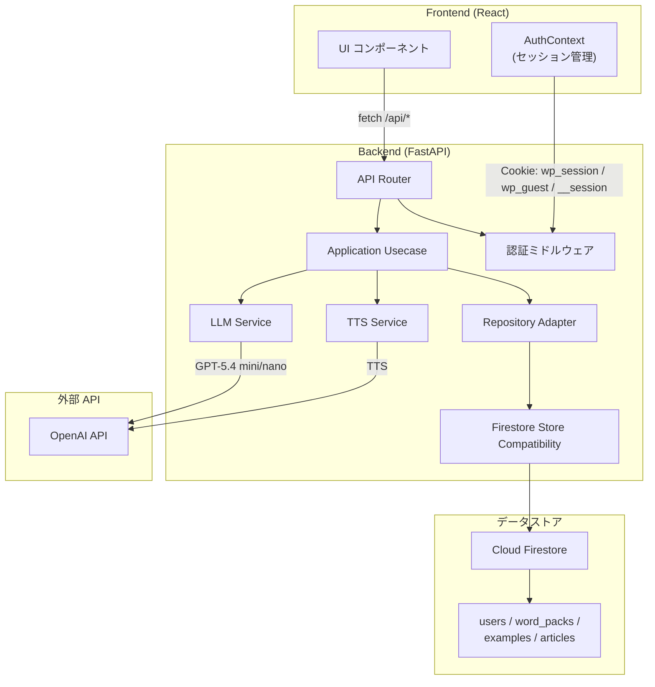

# インフラ構成図

WordPack for English のインフラ構成を示す。

---

## 本番環境（Production）


```mermaid
flowchart TB
    subgraph Users["ユーザー"]
        Browser["🌐 ブラウザ"]
    end

    subgraph GCP["Google Cloud Platform"]
        subgraph Firebase["Firebase"]
            Hosting["Firebase Hosting<br/>(静的ファイル配信)"]
            Firestore["Cloud Firestore<br/>(データストア)"]
        end

        subgraph CloudRun["Cloud Run"]
            Backend["wordpack-backend<br/>(FastAPI / Uvicorn)"]
        end

        subgraph ArtifactRegistry["Artifact Registry"]
            DockerImage["wordpack/backend<br/>(Docker イメージ)"]
        end

        LB["Cloud Load Balancer<br/>(HTTPS 終端)"]
    end

    subgraph External["外部サービス"]
        OpenAI["OpenAI API<br/>(gpt-5.6-luna / TTS)"]
        GoogleOAuth["Google OAuth 2.0<br/>(認証)"]
        Langfuse["Langfuse<br/>(LLM トレース)<br/>※ Optional"]
    end

    Browser -->|HTTPS| Hosting
    Browser -->|HTTPS /api/**| LB
    LB -->|X-Forwarded-For| Backend
    Hosting -->|rewrite /api/**| Backend
    Backend -->|Read/Write| Firestore
    Backend -->|LLM / TTS| OpenAI
    Backend -->|トレース送信| Langfuse
    Browser -->|ID トークン取得| GoogleOAuth
    Backend -->|ID トークン検証| GoogleOAuth
    DockerImage -.->|デプロイ| Backend
```

### コンポーネント説明

| コンポーネント | 役割 |
|---------------|------|
| **Firebase Hosting** | React + Vite でビルドした静的ファイルを配信。`/api/**` へのリクエストを Cloud Run へリライト。 |
| **Cloud Run** | FastAPI バックエンドを実行。`Dockerfile.backend` でビルドしたイメージをデプロイ。 |
| **Cloud Firestore** | ユーザー情報・WordPack・例文・インポート記事を永続化。ゲスト閲覧用のデモデータは `word_packs.metadata.guest_demo=true` で識別する。`firestore.indexes.json` で複合インデックスを管理。 |
| **Artifact Registry** | Cloud Build でビルドした Docker イメージを保存。 |
| **Cloud Load Balancer** | HTTPS 終端と `X-Forwarded-For` によるクライアント IP 復元。 |
| **OpenAI API** | WordPack 生成（gpt-5.6-luna）と音声読み上げ（gpt-4o-mini-tts）。 |
| **Google OAuth 2.0** | フロントエンドでの Google ログイン。バックエンドは `/api/config` でクライアント ID を配布し、受け取った ID トークンを検証してセッションを発行する。 |
| **Langfuse** | LLM のプロンプト・レスポンスをトレース（任意設定）。 |

---

## ローカル開発環境


```mermaid
flowchart TB
    subgraph Dev["開発者マシン"]
        subgraph DockerCompose["Docker Compose"]
            FrontendContainer["frontend<br/>(Node.js / Vite Dev Server)<br/>:5173"]
            BackendContainer["backend<br/>(FastAPI / Uvicorn --reload)<br/>:8000"]
        end

        subgraph Local["ローカルストレージ"]
            FirestoreEmulator["Firebase Emulator<br/>(Firestore)<br/>:8080"]
            ChromaDB["ChromaDB<br/>(.chroma/)"]
        end
    end

    subgraph External["外部サービス"]
        OpenAI["OpenAI API"]
        GoogleOAuth["Google OAuth 2.0"]
    end

    FrontendContainer -->|API リクエスト| BackendContainer
    BackendContainer -->|永続化| FirestoreEmulator
    BackendContainer -->|LLM / TTS| OpenAI
    FrontendContainer -->|Google ログイン| GoogleOAuth
    BackendContainer -->|ID トークン検証| GoogleOAuth
```

### 起動コマンド

```bash
# Docker Compose で一括起動
docker compose up --build

# または個別起動
# Backend
python -m uvicorn backend.main:app --reload --app-dir apps/backend

# Frontend
cd apps/frontend && npm run dev
```

### Firestore 接続先

| 条件 | データストア | 用途 |
|-------------|-------------|------|
| `FIRESTORE_EMULATOR_HOST` あり | Firestore Emulator | ローカル開発 / CI |
| `FIRESTORE_EMULATOR_HOST` なし | Cloud Firestore | 本番 / 検証 |

`ENVIRONMENT` は認証やセキュリティ既定値に使い、Firestore の接続先切り替えには使わない。詳細は [docs/firestore.md](./firestore.md) を参照する。

---

## CI/CD パイプライン


```mermaid
flowchart LR
    subgraph GitHub["GitHub"]
        Push["Push / PR"]
        Actions["GitHub Actions"]
    end

    subgraph CI["CI ジョブ"]
        BackendTest["Backend tests<br/>(pytest)"]
        SecurityTest["Security headers tests"]
        FrontendTest["Frontend tests<br/>(vitest)"]
        UiTestScope["UI test scope<br/>(changed path classifier)"]
        PlaywrightSmoke["Playwright smoke<br/>(PR critical flows)"]
        VisualRegression["Playwright visual<br/>(rendering changes)"]
        CloudRunGuard["Cloud Run config guard<br/>(dry-run)"]
    end

    subgraph CD["CD / preflight"]
        ProductionDeploy["Deploy to production<br/>(CI success workflow_run / manual SHA)"]
        DeployPreflight["Production deploy preflight<br/>(schedule/manual main, read-only)"]
        FirestoreIndex["Firestore インデックス同期"]
        CloudBuild["Cloud Build"]
        CloudRun["Cloud Run デプロイ"]
    end

    Push --> Actions
    Actions --> BackendTest
    Actions --> SecurityTest
    Actions --> FrontendTest
    Actions --> UiTestScope
    BackendTest --> PlaywrightSmoke
    FrontendTest --> PlaywrightSmoke
    UiTestScope --> PlaywrightSmoke
    UiTestScope --> VisualRegression
    SecurityTest --> CloudRunGuard
    Actions -->|schedule / main manual| DeployPreflight
    Actions -->|CI completed successfully| ProductionDeploy
    ProductionDeploy --> FirestoreIndex
    FirestoreIndex --> CloudBuild
    CloudBuild --> CloudRun
```

### CI ジョブ一覧

| ジョブ名 | トリガー | 内容 |
|---------|---------|------|
| **Backend tests** | push / PR | `PYTHONPATH=apps/backend` で `pytest` を実行し、`pytest.ini` の `addopts` に揃えた `apps/backend/backend` のカバレッジが 60% 以上であることを検証 |
| **Security headers tests** | push / PR | セキュリティヘッダー検証（HSTS, CSP, etc.） |
| **Frontend tests** | push / PR | `vitest --coverage` によるフロントエンドテストと、lines/statements 80%、branches 70%、functions 66% のカバレッジ閾値チェック（functions は段階的に 70%→75%→80% へ引き上げ予定） |
| **Playwright smoke** | `pull_request`（主要導線に影響する変更かつBackend / Frontendテスト成功後）/ `main` push | Playwright の主要導線スモークテスト（`auth.spec.ts` / `guest.spec.ts` / `wordpack-server-query.spec.ts` / `wordpack.spec.ts`）。文書やtest-only変更はPRでskipし、mainへのpushではデプロイ前提として常に実行 |
| **Visual regression** | `pull_request`（描画に影響し得る変更のみ） | frontend runtime source、visual test／snapshot、関連するbuild・依存設定が変わった場合にPlaywrightの視覚回帰 (`tests/e2e/visual.spec.ts`) を実行。frontendのtest-only・型宣言だけの変更はskip |
| **UI test selection gate** | push / PR | changed path分類、Backend／Frontend、選択されたPlaywright smokeの結果を集約し、前提失敗によるsmoke skipを成功扱いにしない |
| **Visual test selection gate** | `pull_request` | changed path分類と選択されたVisual Regressionの結果を集約し、分類失敗や予期しないskipを成功扱いにしない |
| **Cloud Run config guard** | Security headers 成功後 | デプロイスクリプトの lint と dry-run 検証 |
| **Production deploy preflight** | schedule / `workflow_dispatch`（main refのみ） | 信頼済み main code で gcloud、Firestore、Firebase Hosting の read-only probe。credential 欠如は fail-closed |
| **Deploy to production** | `CI` `workflow_run`（success / push / main / 同一SHA）または `workflow_dispatch`（target SHA必須） | GitHub APIでCI成功を照合し、対象SHAへcheckoutして `make release-cloud-run` と Firebase Hosting deploy を実行。PRでは本番デプロイ job を作らない |

静的な Cloud Run dry-run と deploy contract 検証は `CI` lane に集約し、重複する `deploy-dry-run.yml` workflow は置かない。本番デプロイは `CI` の同一SHA成功を `workflow_run` 側で再検証してから開始する。PR では本番デプロイ job を作らず、認証済み probe は schedule または main ref の手動実行に限定する。

CD のチェック表示は GitHub Actions に集約する。`workflow_run` は検証済み `workflow_run.head_sha` を checkout し、manual break-glass は GitHub API で指定 SHA の成功CIを照合する。Cloud Build は `cloudbuild.backend.yaml` でバックエンド image build のみを担当し、GitHub Checks API への通知は行わない。これにより Cloud Build 内の外部通知が詰まって Cloud Run デプロイ開始前に止まるリスクを避ける。

### E2E 実行レイヤ（Playwright）

Playwright の E2E は実行レイヤごとにスコープとブラウザを分離する。PR では最短のスモークのみを CI に含め、フル回帰は必要時に手動実行（workflow_dispatch）で起動する専用ワークフローで扱う。

| レイヤ | トリガー | ブラウザ | 実行コマンド | 成果物 |
|---|---|---|---|---|
| PR スモーク | `pull_request`（主要導線に影響する変更時） | Chromium | `npx playwright test -c tests/e2e/playwright.config.ts tests/e2e/auth.spec.ts tests/e2e/guest.spec.ts tests/e2e/wordpack-server-query.spec.ts tests/e2e/wordpack.spec.ts` | `playwright-report/`, `test-results/` |
| PR ビジュアル回帰 | `pull_request`（描画に影響する変更時） | Chromium | `npx playwright test -c tests/e2e/playwright.config.ts tests/e2e/visual.spec.ts` | `playwright-report/`, `test-results/` |
| 手動回帰 | `workflow_dispatch` | Chromium | `npx playwright test -c tests/e2e/playwright.config.ts --browser=chromium` | `playwright-report/`, `test-results/` |

各レイヤの実行前に `npx playwright install --with-deps` を実行してブラウザを取得する。成果物は GitHub Actions の Artifacts として 90 日保持する。ビジュアル回帰の差分画像や HTML レポートは対象ワークフローの実行画面から `playwright-report/` と `test-results/` をダウンロードして確認する。

PRの変更path分類は `scripts/classify_ui_test_changes.py` を正本とする。Playwright workflow自体は全PRで起動し、対象外の重いjobだけをjob条件でskipするため、required checkに設定された場合もworkflow-level path filterによるpendingを残さない。文書、ガバナンス、test-onlyなど既知の非UI pathだけを明示的にskipし、未分類pathは見逃しを避けてsmokeとvisualの両方を起動する。runtime source、user-visible backend、E2E本体、依存・build設定は保守的に対象へ含める。

branch rulesでUIテストをrequiredにする場合は、条件付きのPlaywright job単体ではなく `UI test selection gate` と `Visual test selection gate` を対象にする。各selection gateは、テスト対象外の明示的skipだけを許容し、classifier・依存job・選択されたPlaywright jobの失敗を集約して失敗として報告する。

---

## デプロイフロー


```mermaid
sequenceDiagram
    participant Dev as 開発者
    participant GitHub as GitHub
    participant Actions as GitHub Actions
    participant GCloud as gcloud CLI
    participant AR as Artifact Registry
    participant CR as Cloud Run
    participant FS as Firestore

    Dev->>GitHub: git push main
    GitHub->>Actions: CI トリガー
    Actions->>Actions: pytest / vitest / Playwright smoke
    Actions-->>Actions: CI success / target SHA確定
    Actions->>Actions: workflow_run が同一SHAを検証

    Note over Dev: manual break-glass は target SHA と成功CIを要求
    Dev->>GCloud: make release-cloud-run
    GCloud->>FS: Firestore インデックス同期
    GCloud->>AR: Cloud Build (イメージ push)
    AR->>CR: gcloud run deploy
    CR-->>Dev: デプロイ完了
```

### デプロイコマンド

```bash
# Firestore インデックス同期 → dry-run → 本番デプロイ
make release-cloud-run \
  PROJECT_ID=my-prod-project \
  REGION=asia-northeast1 \
  ENV_FILE=.env.deploy
```

---

## ネットワーク構成


```mermaid
flowchart LR
    subgraph Internet["インターネット"]
        Client["クライアント"]
    end

    subgraph GCP["GCP"]
        GLB["Google Cloud<br/>Load Balancer<br/>(35.191.0.0/16,<br/>130.211.0.0/22)"]
        Hosting["Firebase Hosting<br/>(*.web.app)"]
        CR["Cloud Run<br/>(*.a.run.app)"]
    end

    Client -->|HTTPS| GLB
    GLB -->|X-Forwarded-For| CR
    Client -->|HTTPS| Hosting
    Hosting -->|/api/** rewrite| CR
```

### セキュリティ設定

| 設定項目 | 環境変数 | 説明 |
|---------|---------|------|
| **CORS** | `CORS_ALLOWED_ORIGINS` | 許可するフロントエンドオリジン |
| **信頼プロキシ** | `TRUSTED_PROXY_IPS` | X-Forwarded-For を信頼する CIDR |
| **許可ホスト** | `ALLOWED_HOSTS` | TrustedHostMiddleware で許可するホスト名 |
| **HSTS** | `SECURITY_HSTS_MAX_AGE_SECONDS` | HTTP Strict Transport Security の max-age |
| **CSP** | `SECURITY_CSP_DEFAULT_SRC` | Content Security Policy の default-src |

---

## データフロー


```mermaid
flowchart TB
    subgraph Frontend["Frontend (React)"]
        UI["UI コンポーネント"]
        AuthContext["AuthContext<br/>(セッション管理)"]
    end

    subgraph Backend["Backend (FastAPI)"]
        Router["API Router"]
        Usecase["Application Usecase"]
        Auth["認証ミドルウェア"]
        LLMService["LLM Service"]
        TTSService["TTS Service"]
        Repository["Repository Adapter"]
        Store["Firestore Store Compatibility"]
    end

    subgraph Data["データストア"]
        Firestore["Cloud Firestore"]
        Collections["users / word_packs /<br/>examples / articles"]
    end

    subgraph External["外部 API"]
        OpenAI["OpenAI API"]
    end

    UI -->|fetch /api/*| Router
    Router --> Auth
    Router --> Usecase
    Usecase --> LLMService
    Usecase --> TTSService
    Usecase --> Repository
    Repository --> Store
    LLMService -->|GPT-5.4 mini/nano| OpenAI
    TTSService -->|TTS| OpenAI
    Store --> Firestore
    Firestore --> Collections
    AuthContext -->|Cookie: wp_session / wp_guest / __session| Auth
```

---

## 参照

- [README.md](../README.md) - プロダクト概要と最短起動
- [docs/環境変数の意味.md](./環境変数の意味.md) - 環境変数の一覧と説明
- [docs/deployment.md](./deployment.md) - Cloud Run / Firebase Hosting / GitHub Actions デプロイ手順
- [docs/firestore.md](./firestore.md) - Firestore インデックス、エミュレータ、シード、削除運用
- [docs/flows.md](./flows.md) - API フロー図
- [docs/models.md](./models.md) - データモデル定義
- [firestore.indexes.json](../firestore.indexes.json) - Firestore インデックス定義
